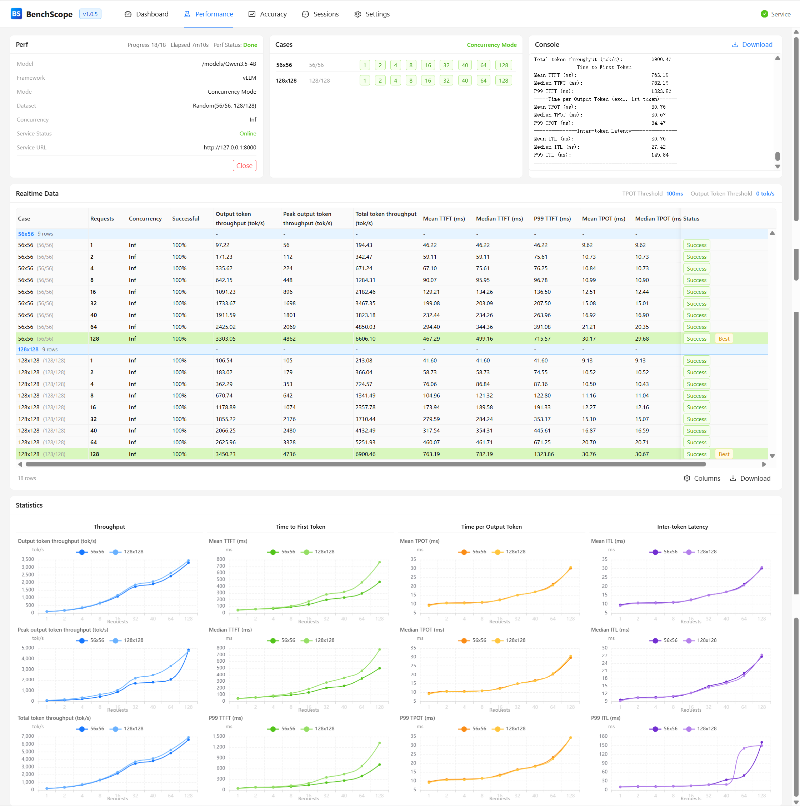

# benchscope

[English](README.md) | **简体中文**

> LLM 模型**性能与精度可视化测试平台**，支持 vLLM、SGLang 部署的模型及任意 OpenAI 兼容推理服务。

<div align="center">
  
</div>

---

## 特性

- **安装简单** — `pip install` 后一条命令即可启动整个 Web 平台。
- **性能测试双模式** — 并发压测（Concurrency Mode）与阈值探测（Threshold Mode，自动寻找满足条件的最大并发）。
- **精度测试双模式** — 在线测试 / 离线测试（规划中，v5.0）。
- **实时数据反馈** — 每个并发结果实时流入表格、曲线与进度。
- **可视化曲线** — 吞吐 / TTFT / TPOT / ITL 多维统计图。
- **日志缓存下载** — 运行日志、mean/P99 汇总与 Excel 导出，支持在线预览与下载。

## 快速开始

```bash
# 从 PyPI 安装
pip install benchscope

# 启动
benchscope

# 选项
benchscope --port 8080 --no-browser
```

## 开发

见 [docs/Readme.md](docs/Readme.md) 文档。

## 开源

- **许可证** — [Apache License 2.0](LICENSE)
- **发布** — [PyPI: benchscope](https://pypi.org/project/benchscope/)
- **源码** — <https://github.com/LABELNET/benchscope>
- **贡献** — 欢迎在源码仓库提出 Issue / PR
